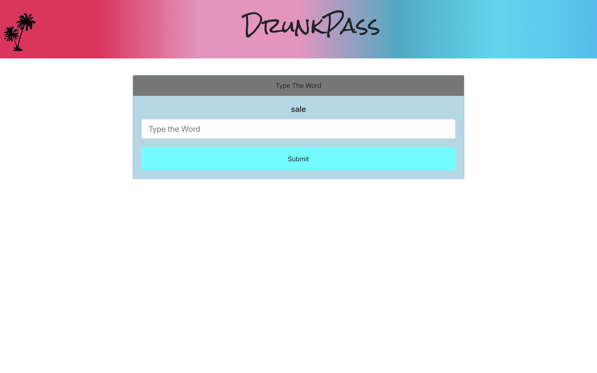
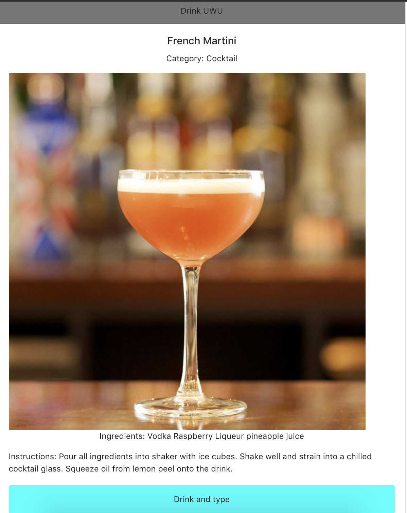
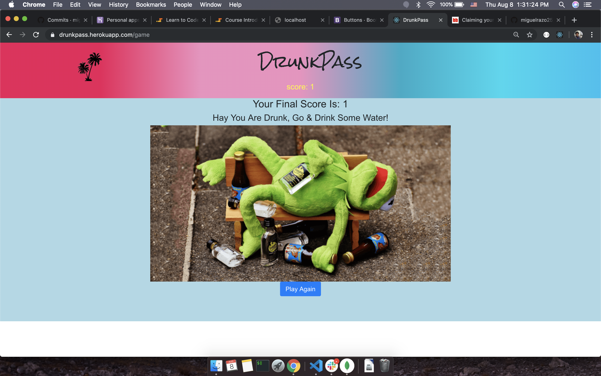

 #  `DrunkPass` 
 
 ## `Description`  
 
This application is fynny game which will be determine you either you are drunk or not.

# `Rules`  

- You must be 21 years old or above.
- If you are below 21 years old then you can't participate the game.
- After entering the game, you have to take real time peg wine then click the buttom
- There is ramdom word will be appeared to your screen. After 5 second it will disapear.
- You have to read and type the word inside the text box.
- If it is matched with given word then you will get 1 point.
- At the same time you will see the picture of wine/soda/beer/coffee and its ingredient
- Again you have to take another short of drink and click the buttom.
- If you can't read or mis typed given world then we asume that you are drunk.
- Its all about proof of concept for a password manager and generator for when you've had to much to drink.

## Technology Used  

- [x] [React](https://facebook.github.io/create-react-app/docs/getting-started)
- [x] MongoDB
- [x] HTML
- [x] Bootstrap
- [x] CSS

## Package Used  

- [x] mongoose
- [x] express
- [x] axios
- [x] random-words
- [x] moment
- [x] react-router-dom

### Deployment at herokuapp  

Click here to Play [Drunkpass](https://drunkpass.herokuapp.com/)

### Screenshot

- Landing Page

- Verification Page

- Random_words Page 

- Ingredients Page

- Game over playAgain Page

